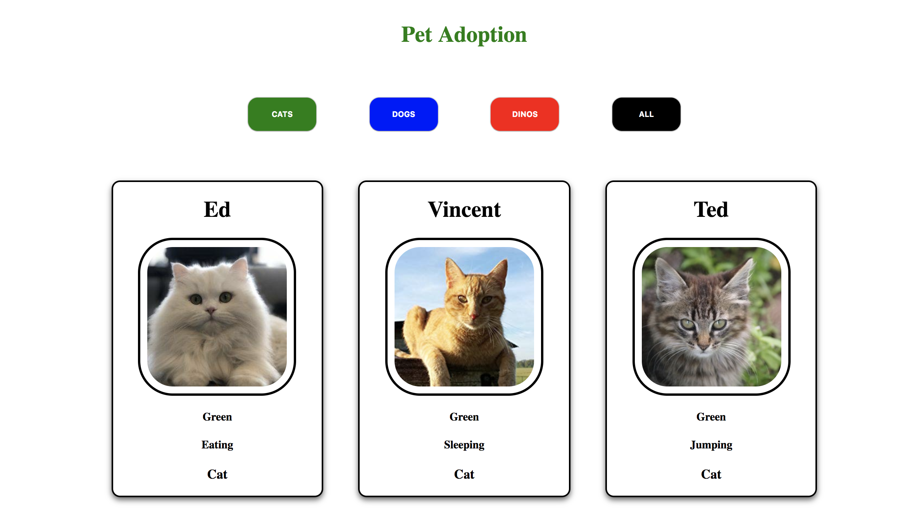

# Pet Adoption 

## Description
 
Use this application to filter through the available pets for adoption by clicking on the button of pet categories. 
 
## Screenshot

 
## How to Run:
  * Clone this project
  * Install [http-server] (https://www.npmjs.com/package/http-server) from npm
  * At the root of this project run the following command: `hs -p 8888`
  * In your browser navigate to `https://localhost:8888`